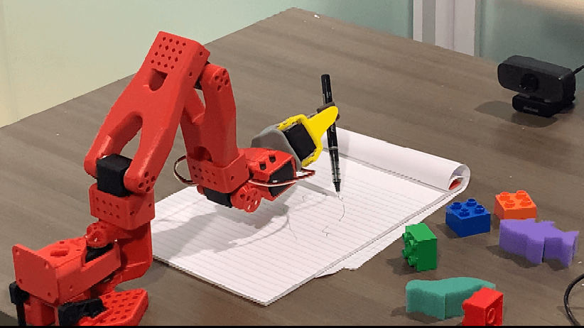
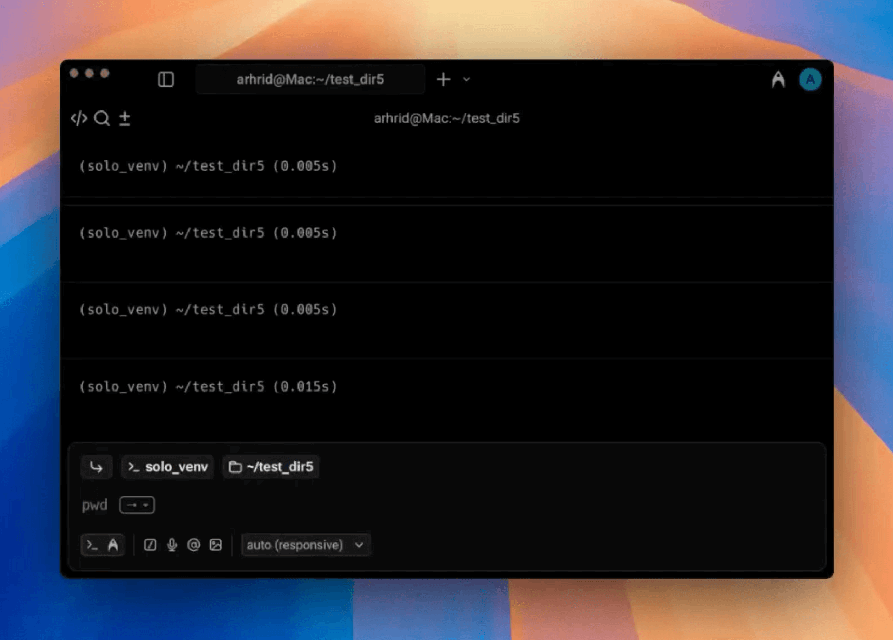

# Solo CLI

<div align="center">

[](https://www.python.org/downloads/)
[](https://opensource.org/license/apache-2-0)
[](https://pypi.org/project/solo-cli/)

**Fastest way to deploy Physical AI on your hardware**

Simple CLI for Physical AI:
*Fine-tune and serve models in the physical world; optimized for edge & on-device operations*

</div>

<p align="center">
  
</p>

---

> **📢 IMPORTANT: Package Renamed**
> 
> This package has been renamed from **`solo-server`** to **`solo-cli`**!
> 
> If you're upgrading from `solo-server`, please see the **[Migration Guide](MIGRATION.md)** for upgrade instructions.
> 
> - **Old**: `pip install solo-server`
> - **New**: `pip install solo-cli`
> - **Config Migration**: `~/.solo_server` → `~/.solo`
> - **CLI Command**: Still `solo` (unchanged) ✅

---

Solo-CLI powers users of Physical AI Inference by providing access to efficiency tuned AI models in the real world. From language to vision to action models, Solo-CLI allows you to interact with cutting-edge, on-device AI directly within the terminal. It is tailored for context aware intelligence, specialized for mission-critical tasks, and tuned for the edge.

<p align="center">
  <a href="https://docs.getsolo.tech">Docs</a> |
  <a href="https://getsolo.tech">About</a>
</p>

<div align="center">
  <table>
    <tr>
      <td align="center"></td>
      <td align="center"></td>
    </tr>
  </table>
</div>

## Installation

> **Upgrading from solo-server?** See the [Migration Guide](MIGRATION.md) first.

First, install the uv package manager and setup a virtual environment as 
explained in [prereq.md](prereq.md)

```bash

#Choose one of the following for solo-cli installation
#1. Install solo cli from PyPI python manager
uv pip install solo-cli

#2. Install solo cli from source
git clone https://github.com/GetSoloTech/solo-cli.git
cd solo-cli
uv pip install -e .

# Solo commands
solo --help

```

## 💻 Solo Tech Installation Demo

<p align="center">
  
</p>

**For the full installation demo, [click here to watch on YouTube](https://www.youtube.com/embed/x2pVuYr08vk).** 

## Quick Installation for Mac (Automated)

For Mac users, we provide an automated installation script that handles all the setup steps:

```bash
# Clone the repository
git clone https://github.com/GetSoloTech/solo-cli.git
cd solo-cli

# Make the installation script executable
chmod +x install_mac.sh

# Run the automated installation
./install_mac.sh
```

The script will automatically:
- Install uv package manager (version 0.9.3)
- Create a virtual environment with Python 3.12.12
- Set up environment variables for dependencies
- Install solo-cli in development mode with fallback handling for mujoco dependencies

After installation, activate the virtual environment:
```bash
source solo_venv/bin/activate
```

<!-- <details>
<summary><strong>Video: quickstart installation</strong></summary>

[](https://youtu.be/bGjaIfKvyAA)

</details> -->


## 💻 Quick Installation Demo

<p align="center">
  
</p>

---

**To see the full video, [click here to watch on YouTube](https://www.youtube.com/watch?v=bGjaIfKvyAA).** 

## Solo Commands:

```bash
solo --help
                                                                                                           
╭─ Commands ────────────────────────────────────────────────────────────────────────────────────────────────────────╮
│ setup      Set up Solo CLI environment with interactive prompts and saves configuration to config.json.           │
│ robo       Robotics operations: motor setup, calibration, teleoperation, data recording, training, and inference  │
│ serve      Start a model server with the specified model.                                                         │
│ status     Check running models, system status, and configuration.                                                │
│ list       List all downloaded models available in HuggingFace cache and Ollama.                                  │
│ test       Test if the Solo CLI is running correctly. Performs an inference test to verify server functionality.  │
│ stop       Stops Solo CLI services. You can specify a server type with 'ollama', 'vllm', or 'llama.cpp'           │
│            Otherwise, all Solo services will be stopped.                                                          │
│ download   Downloads a Hugging Face model using the huggingface repo id.                                          │
╰───────────────────────────────────────────────────────────────────────────────────────────────────────────────────╯

```
## Start server with SML models

```bash

# Note that you will need Docker for solo serve
solo setup
solo serve --server ollama --model llama3.2:1b
```

## Interactive Lerobot With Solo CLI
Find more details here: [Solo Robo Documentation](solo/commands/robots/lerobot/README.md) 

```bash
# Motors (both) → Calibrate (both) → Teleop
solo robo --motors all
solo robo --calibrate all
solo robo --teleop

# Record a new local dataset with prompts
solo robo --record

# Train ACT or SmolVLA Policy on a recorded dataset and push to Hub
solo robo --train

# Inference with a hub model id (with optional Teleop override)
solo robo --inference

# Replay a recorded episode
solo robo --replay

# Use -y or --yes to auto-use saved settings (skip prompts)
solo robo --teleop -y
solo robo --record --yes
```

## API Reference
Find more details here: OpenAI -> [OpenAI API Docs](https://platform.openai.com/docs/api-reference/introduction) Ollama -> [Ollama API Docs](https://docs.ollama.com/api)

### vLLM & llama.cpp (OpenAI Compatible)

```bash
# Chat request endpoint
curl http://localhost:5070/v1/chat/completions \
  -H "Content-Type: application/json" \
  -d '{
    "model": "llama3.2",
    "messages": [{"role": "user", "content": "Analyze sensor data"}],
    "tools": [{"type": "mcp", "name": "VitalSignsMCP"}]
  }'
```

### Ollama
```bash
# Chat request endpoint
curl http://localhost:5070/api/chat -d '{
  "model": "llama3.2",
  "messages": [
    {
      "role": "user",
      "content": "why is the sky blue?"
    }
  ]
}'
```

## Configuration
Navigate to config file
`.solo/config.json` 

```json
{
    "hardware": {
        "use_gpu": false,
        "cpu_model": "Apple M3",
        "cpu_cores": 8,
        "memory_gb": 16.0,
        "gpu_vendor": "None",
        "gpu_model": "None",
        "gpu_memory": 0,
        "compute_backend": "CPU",
        "os": "Darwin"
    },
    "user": {
        "domain": "Software",
        "role": "Full-Stack Developer"
    },
    "server": {
        "type": "ollama",
        "ollama": {
            "default_port": 5070
        }
    },
    "active_model": {
        "server": "ollama",
        "name": "llama3.2:1b",
        "full_model_name": "llama3.2:1b",
        "port": 5070,
        "last_used": "2025-10-09 11:30:06"
    }
}
```

## Contributing

1. Fork the repository
2. Create feature branch (`git checkout -b feature/name`)
3. Commit changes (`git commit -m 'Add feature'`)
4. Push to branch (`git push origin feature/name`)
5. Open Pull Request 